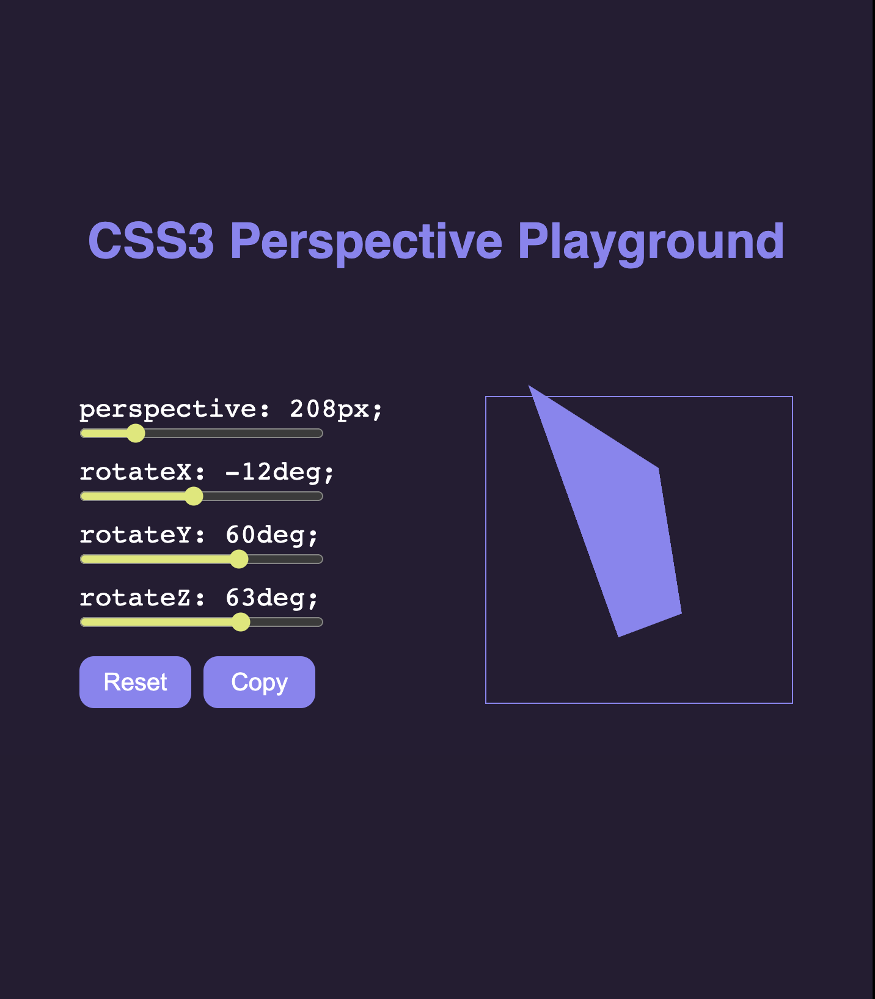

# CSS-Perspective-Playground
### This a tool to test and play around with [The perspective CSS property](https://developer.mozilla.org/fr/docs/Web/CSS/perspective). 
[Live link](https://css-perspective-playground.vercel.app/)

